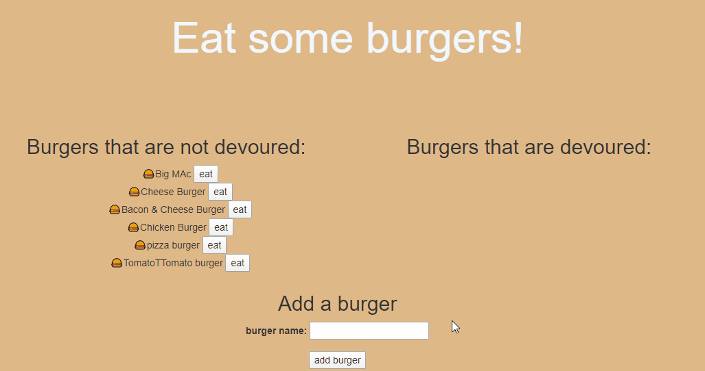

# Do-you-want-to-Eat-Burgers

I will create a burger logger with MySQL, Node, Express, Handlebars and a homemade ORM (yum!). I followed the MVC design pattern; using Node and MySQL to query and route data in my app, and Handlebars to generate the HTML

## Table of Content

- [Description](#description)
- [Development](#development)
- [User Story](#user-story)
- [Installation](#installation)
- [Schema](#schema)
- [Dependencies](#dependencies)
- [Tests](#tests)
- [Built With](#built-with)
- [Questions](#questions)
- [Demo](#demo)
- [License](#license)
- [Acknowledgments](#acknowledgments)
- [CopyRight](#copyright)

## Description

This is a full stack web app. From HTL, CSS, Jquery to Node.js, Express, JAWSDB and Heroku

## Development

Created the MVC structure first and worked upon each element required, starting from the node.js, using terminal and running ``npm i``, installing all the required dependencies, and started by creating the schema.sql and seeds.sql, preparing the database, credentials and being able to connect to it
Below some links of interest:

- node.js - https://nodejs.org/en/
- heroku-cli NPM Package - https://www.npmjs.com/package/heroku-cli
- express NPM Package - https://www.npmjs.com/package/express
- path NPM Package - https://www.npmjs.com/package/path

## User Story

- Eat-Da-Burger! is a restaurant app that lets users input the names of burgers they'd like to eat.

- Whenever a user submits a burger's name, your app will display the burger on the left side of the page -- waiting to be devoured.

- Each burger in the waiting area also has a Devour it! button. When the user clicks it, the burger will move to the right side of the page.

- My app will store every burger in a database, whether devoured or not.

## Installation

To use this application locally:

- Clone the GitHub repository at:
- You will to install all the dependencies, see [Dependencies](#dependencies) for the complete list
- Using ```npm install```, install all the dependcies
- Using MySQL or MSSQL database, create the DB using the _schema.sql_ file, you can reciew the database schema on the [Sql schema](#schema) file
- Using the _seeds.sql_ file to popluate the DB
- Once you have all the above created, you can edit the _server.js_ file where the password is and add your password to access your local DataBase.
- You can then open a terminal or cmd prompt, navigate to the folder where **_server.js_** is located and type: ``node server.js``
- Once the server is running, open a browser and navigate to localhost:8080 or the port you have selected
- Enjoy creating your burgers and eating them!

### Schema

Using one table for the app to work, only 3 columns, id, burger_name and devoured. See below syntax

```SQL
DROP DATABASE IF EXISTS burgers_db;
CREATE DATABASE burgers_db;
USE burgers_db;

CREATE TABLE burgers
(
    id int NOT NULL AUTO_INCREMENT,
    burger_name VARCHAR(110) NOT NULL,
    devoured BOOLEAN DEFAULT false,
    PRIMARY KEY (id)
)
```

### Dependencies

```JSON
    "express": "^4.17.1"
    "express-handlebars": "^4.0.4"
    "mysql": "^2.18.1"
```

## Tests

Work in progress. Ran out of time to implement these, I will get back to this project at a later date to finalize these

## Built With

- [VScode](https://code.visualstudio.com/) - The editor of choice
- [Notepad++](https://notepad-plus-plus.org/) - My second editor
- [Gitbash](https://gitforwindows.org/) - What would we do without our bash?

### Questions

1. How can I run the application?  
You just need to follow the instructions on the [installation](#installation) section, where it is explained

2. What if I get an error?  
Ensure that you have install all the dependencies required for this to work. See [Dependencies](#dependencies) section

3. Can I refractor the code in the any of the files file?
Yes, you can modify and refractor the code

## Demo



## License

[MIT License](./LICENSE)

### Authors

- **John Merchan**

## Acknowledgments

To my 2 sons, who give me the power I need to keep going.
To Agustin, mentor in my learnings.

### CopyRight

Copyright 2020 &copy; John Merchan

:australia:

[Table of Content](#Table-of-Content) --- [Back to Top](#Do-you-want-to-Eat-Burgers) --- [Installation](#Installation)
